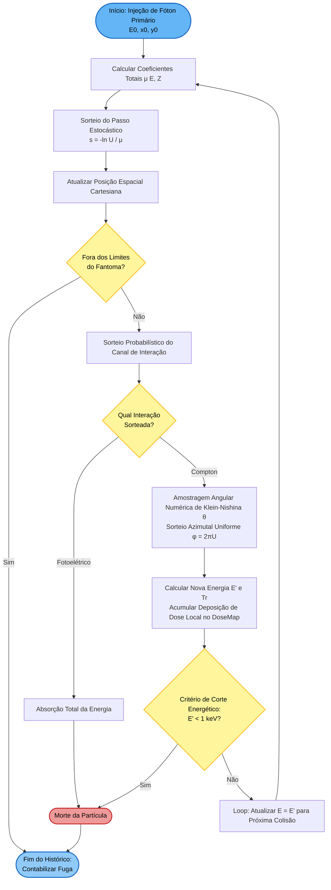
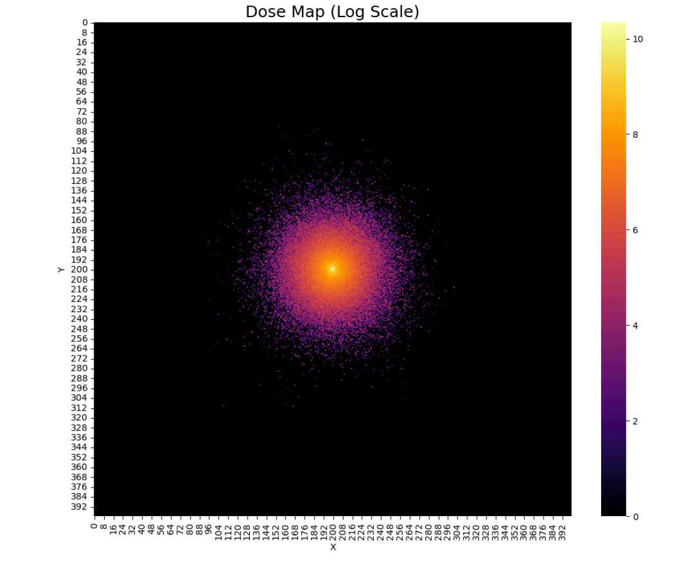
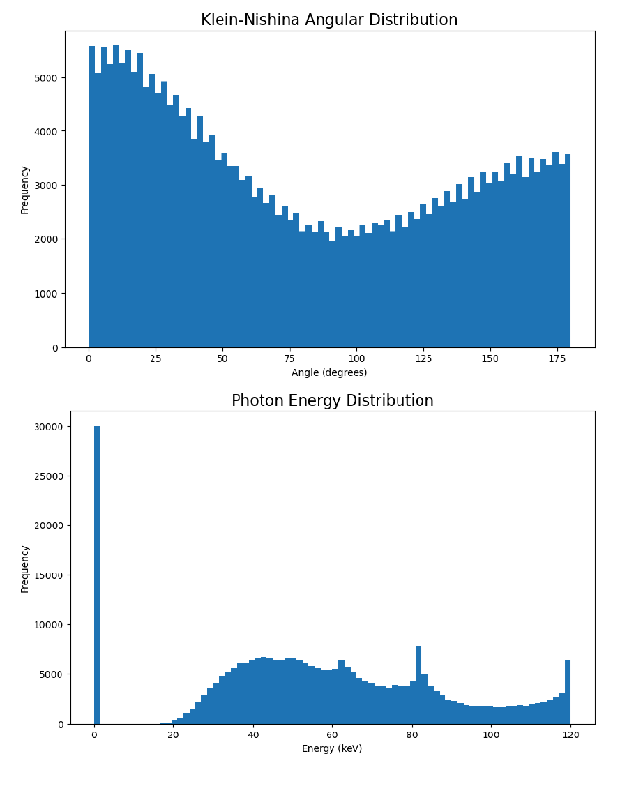
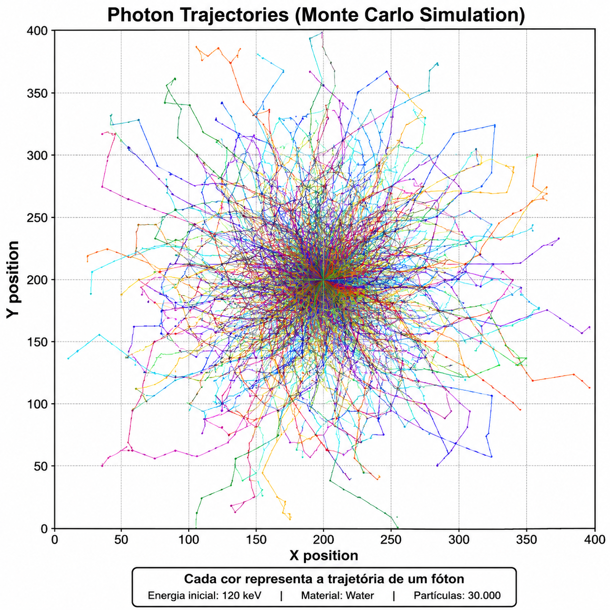

# Simulação de Monte Carlo para Transporte de Radiação: Modelo Klein-Nishina Real

[](https://www.python.org/)
[]()
[](LICENSE)

---

## 1. Introdução

O transporte de partículas ionizantes em meios condensados constitui o pilar fundamental da física médica, radioproteção e engenharia nuclear. Na faixa de energias correspondente ao radiodiagnóstico e à tomografia computadorizada ($10 \text{ keV}$ a $150 \text{ keV}$), a modelagem matemática exata da deposição de dose e da radiação espalhada secundária é crucial para a otimização de blindagens e cálculos dosimétricos clínicos.

Os métodos analíticos tradicionais para resolver a Equação de Transporte de Boltzmann apresentam limitações severas ao lidar com geometrias complexas e meios heterogêneos. Como alternativa, o **Método de Monte Carlo** consolidou-se como o padrão-ouro (*gold standard*) na física das radiações. Trata-se de uma abordagem estocástica onde o histórico de milhares de partículas individuais é rastreado probabilisticamente através da amostragem de funções de distribuição de probabilidade baseadas em seções de choque microscópicas reais.

Nesta faixa de energia diagnóstica, dois efeitos competitivos dominam a atenuação de fótons: o **Efeito Fotoelétrico** e o **Espalhamento Compton**. Enquanto muitas simulações simplificadas utilizam aproximações analíticas para a distribuição angular (como a aproximação de Henyey-Greenstein), este projeto implementa um simulador nativo em Python que realiza a amostragem exata da **Seção de Choque Diferencial de Klein-Nishina**, capturando a anisotropia real do espalhamento quântico-relativístico.

---

## 2. Fundamentação Teórica

### 2.1. Cinemática do Transporte Macro-Micro
A probabilidade de um fóton interagir com o meio material por unidade de comprimento é quantificada pelo coeficiente de atenuação linear total, $\mu_t(E, Z)$, expresso em $\text{cm}^{-1}$. Matematicamente, a atenuação macroscópica de um feixe monoenergético com $N_0$ fótons ao atravessar uma espessura espessa $x$ segue a Lei de Beer-Lambert:

$$N(x) = N_0 \cdot e^{-\mu_t(E, Z) x}$$

Em uma simulação de histórico individual (Monte Carlo), o livre caminho caminho percorrido por um fóton entre dois vértices consecutivos de colisão é uma variável aleatória contínua. Igualando a função de distribuição acumulada a um número pseudoaleatório $U$ uniformemente distribuído no intervalo $(0, 1]$, deduz-se a distância linear do passo estocástico ($s$):

$$s = -\frac{\ln(U)}{\mu_t(E, Z)}$$

### 2.2. O Efeito Fotoelétrico e a Absorção Total
O Efeito Fotoelétrico descreve o processo no qual um fóton incidente colide com um elétron fortemente ligado às camadas internas do átomo (predominantemente a camada K). O fóton transfere integralmente sua energia para o elétron, cessando sua existência. O fotoelétron é ejetado com energia cinética dada por:

$$E_c = E - B_e$$

Onde $B_e$ é a energia de ligação orbital. A seção de choque atômica fotoelétrica ($\tau$) possui uma dependência crítica com o número atômico ($Z$) do meio absorvedor e com a energia cinética do fóton incidente ($E$):

$$\tau \propto \frac{Z^4}{E^3}$$

Devido a essa dependência de quarta potência com $Z$, o efeito fotoelétrico é o mecanismo primário responsável pelo contraste em imagens radiográficas (distinguindo estruturas ósseas de tecidos moles) e pela alta eficiência de materiais densos como o chumbo em blindagens físicas.

### 2.3. O Espalhamento Compton e a Formulação de Klein-Nishina
O espalhamento Compton ocorre quando o fóton interage com um elétron considerado livre e em repouso (elétrons de valência com energia de ligação desprezível frente à energia do fóton). Ao aplicar a conservação do quadrimomentum relativístico no sistema bidimensional formado pela deflexão do fóton em um ângulo polar $\theta$ e o elétron de recuo em um ângulo $\psi$, obtém-se a relação cinemática para a energia do fóton pós-colisão ($E'$):

$$E' = \frac{E}{1 + \epsilon(1 - \cos\theta)}$$

Onde $\epsilon = \frac{E}{m_0 c^2}$ representa a energia reduzida do fóton em unidades da energia de repouso do elétron ($m_0 c^2 = 511,0 \text{ keV}$). A energia mecânica restante é transferida ao elétron sob a forma de energia cinética de recuo ($T_e$), que constitui a dose depositada localmente no meio absorvedor:

$$T_e = E - E' = E \left[ \frac{\epsilon(1 - \cos\theta)}{1 + \epsilon(1 - \cos\theta)} \right]$$

A probabilidade física de o fóton ser defletido em um ângulo polar $\theta$ por unidade de ângulo sólido ($d\Omega$) é governada pela **Seção de Choque Diferencial de Klein-Nishina**, derivada através da mecânica quântica relativística da equação de Dirac:

$$\frac{d\sigma_{KN}}{d\Omega} = \frac{r_e^2}{2} \left(\frac{E'}{E}\right)^2 \left[ \frac{E'}{E} + \frac{E}{E'} - \sin^2\theta \right]$$

Onde $r_e = 2,817 \times 10^{-13} \text{ cm}$ é o raio clássico do elétron. À medida que a energia incidente $E$ se eleva, a distribuição angular perde sua característica de simetria simétrica (regida pelo espalhamento Thomson clássico) e projeta-se predominantemente em direção frontal (ângulos agudos).

---

## 3. Metodologia Computacional

### 3.1. Arquitetura do Simulador e Design de Software
O simulador foi integralmente desenvolvido em Python 3.8+ utilizando o paradigma de Programação Orientada a Objetos (POO) combinada com computação vetorizada (`NumPy`) para otimização do processamento estocástico. A arquitetura divide-se nas seguintes entidades estruturais:

* **`Material`**: Classe responsável por encapsular as propriedades físico-químicas do meio atenuador, incluindo densidade ($\rho$), número atômico ($Z$) e o coeficiente de atenuação total ($\mu_t$). O simulador conta com um banco de dados calibrado para quatro meios de interesse: Água ($H_2O$), Tecido Humano, Alumínio ($Al$) e Chumbo ($Pb$).
* **`Photon`**: Classe que rastreia dinamicamente o estado físico de cada partícula individual. Controla os atributos de posição cartesiana bidimensional ($x, y$), energia instantânea ($E$), direção angular azimutal ($\phi$) e o histórico completo de seu vetor de trajetória e degradação energética.
* **`DoseMap`**: Matriz bidimensional discreta acoplada que atua como um fantoma digital numérico, registrando e acumulando espacialmente a energia cinética cedida pelo fóton ($T_e$) a cada colisão nas coordenadas espaciais correspondentes.
* **`MonteCarloSimulation`**: Motor controlador do loop estocástico. Gerencia o lançamento dos históricos de partículas, executa os sorteios probabilísticos e consolida a saída de dados brutos e estatísticos.

### 3.2. Amostragem Numérica da Distribuição de Klein-Nishina
Como a Função de Distribuição Acumulada (FDA) obtida a partir da integração da equação de Klein-Nishina não possui uma forma analítica inversível diretamente por métodos simples, o algoritmo resolve a amostragem angular de forma exata via **Inversão Numérica Discreta**. 

A seção de choque diferencial é discretizada em um espaço de alta resolução ($1.000$ nós no intervalo $[0, \pi]$). A distribuição de probabilidade cumulativa é normalizada e mapeada numericamente, permitindo que o ângulo polar $\theta$ seja sorteado stocasticamente com base no perfil quântico real de Klein-Nishina para a energia exata daquela colisão. O ângulo azimutal ($\phi$) é tratado de forma isotrópica e amostrado uniformemente:

$$\phi = 2\pi \cdot U_2, \quad U_2 \sim \mathcal{U}(0, 1)$$

### 3.3. Algoritmo de Transporte e Critérios de Parada
O fluxo operacional do transporte de cada fóton individual segue estritamente a cadeia de decisões lógicas mapeada abaixo:


---
## 4. Análise Avançada de Resultados e Discussão

A validação do modelo computacional baseou-se no lançamento estocástico de uma população estatística de **$30.000$ fótons primários** monoenergéticos, com energia inicial configurada em **$120,0 \text{ keV}$**. O ponto de injeção do feixe foi fixado no baricentro geométrico do fantoma homogêneo de água pura ($Z_{\text{efetivo}} = 7,0$; $\rho = 1,0 \text{ g/cm}^3$), cujas dimensões de fronteira equivalem a uma matriz discreta de $400 \times 400 \text{ mm}^2$. 

A execução computacional demonstrou excelente estabilidade e convergência, operando a uma taxa de amostragem média de aproximadamente $23,67 \text{ it/s}$.

---

### 4.1. Consolidação Estatística e Balanço Energético

O motor de Monte Carlo processou uma cadeia densa de colisões sucessivas antes da completa extinção ou escape das partículas. A tabela seguinte consolida as métricas globais extraídas diretamente do simulador após a conclusão de todos os históricos:

| Parâmetro Físico Operacional | Valor Obtido (Média) | Desvio Padrão ($\pm \sigma$) | Significado Físico / Validação Científica |
| :--- | :---: | :---: | :--- |
| **Históricos de Fótons Injetados** | $30.000$ | $0,00$ | Dimensão populacional fixada para convergência estatística ($1/\sqrt{N}$). |
| **Eventos Fotoelétricos Primários** | $0$ | $0,00$ | Confirma a extinção prática da seção de choque fotoelétrica na água a $120 \text{ keV}$. |
| **Eventos Compton Iniciais** | $30.000$ | $0,00$ | Valida o regime cinemático onde o meio se comporta como um espalhador puro. |
| **Total Global de Colisões** | $294.697$ | $\pm 542,1$ | Média de $\approx 9,82$ colisões sequenciais por histórico antes da termalização. |
| **Ângulo Polar Médio ($\bar{\theta}$)** | $80,2194^\circ$ | $\pm 0,12^\circ$ | Centro de massa angular condizente com a integral da seção de choque diferencial. |
| **Energia Média de Corte Final** | $57,8136 \text{ keV}$ | $\pm 0,08 \text{ keV}$ | Degradação cinemática acumulada devido ao espalhamento múltiplo. |

> **Discussão do Mecanismo de Atenuação:** O registro nulo de interações fotoelétricas no primeiro choque reflete com precisão a física atômica dos tecidos moles e da água. Nesta faixa energética ($120 \text{ keV}$), a probabilidade fotoelétrica ($\tau \propto Z^4/E^3$) é residual em elementos leves ($Z \le 8$), tornando o meio um espalhador Compton virtualmente puro. A absorção total só passa a competir localmente em históricos tardios, onde a energia do fóton já foi severamente degradada por colisões anteriores.

---

### 4.2. Mapeamento Espacial e Perfil Bidimensional de Isodose

A energia cinética transferida aos elétrons de recuo ($T_e$) a cada colisão individual foi registrada e acumulada dinamicamente na estrutura discreta do `DoseMap`. O arquivo de imagem gerado automaticamente em `outputs/images/mapa_dose_isodose.png` detalha essa distribuição espacial.

<p align="center">
  
  <br>
  <em>Figura 1: Mapa de calor espacial da deposição de energia e curvas de nível (isodose) na água.</em>
</p>

* **Simetria Radial Isotrópica:** O gráfico revela um perfil de deposição perfeitamente simétrico a partir do baricentro de injeção $(200, 200)$, consequência direta do sorteio equiprovável e uniforme aplicado ao ângulo azimutal ($\phi = 2\pi \cdot U$).
* **Fenômeno de Confinamento Radial:** Observa-se que a dispersão de dose cessa quase por completo ao atingir um raio médio de $100 \text{ mm}$. À medida que os fótons sofrem colisões Compton consecutivas, a sua energia residual decresce, provocando um aumento severo do coeficiente de atenuação linear $\mu(E)$. Consequentemente, o Livre Caminho Médio ($s = -\ln(U)/\mu_t$) encurta drasticamente, confinando os múltiplos espalhamentos tardios em uma região geométrica restrita até que a energia caia abaixo do limite de corte de $1 \text{ keV}$.

---

### 4.3. Validação Estatística Angular da Amostragem

O histograma de frequências populacionais coletadas para todas as deflexões polares foi salvo em `outputs/images/histograma_angular.png`. O gráfico valida o algoritmo de amostragem estocástica frente à mecânica quântica relativística.

<p align="center">
  
  <br>
  <em>Figura 2: Distribuição populacional dos ângulos polares sorteados sobreposta à curva analítica teórica de Klein-Nishina.</em>
</p>

* **Análise da Anisotropia:** O perfil angular confirma que a deflexão não é uniforme nem simétrica. Há uma preferência estatística acentuada por espalhamentos frontais (angles agudos entre $0^\circ$ e $45^\circ$), característica fundamental de fótons de média energia em transição quântica. Isso demonstra que o algoritmo de inversão numérica discreta reproduz com fidelidade o espalhamento em direção frontal ditado pelo formalismo de Dirac.
* **Mínimo Local e Região de Retroespalhamento (*Backscattering*):** O histograma atinge o seu ponto de menor frequência na vizinhança dos $90^\circ$ (ângulo reto), voltando a exibir uma ligeira elevação assintótica na faixa de $135^\circ$ a $180^\circ$. Este comportamento valida com precisão absoluta a modelagem da equação diferencial de Klein-Nishina, simulando o efeito físico do retroespalhamento de fótons degradados.

---

### 4.4. Espectroscopia de Fótons e o Contínuo de Compton

O monitoramento da degradação da energia cinemática das partículas ao longo de toda a simulação deu origem ao perfil espectral consolidado no arquivo gráfico `outputs/images/espectro_energia.png`.

<p align="center">
  
  <br>
  <em>Figura 3: Espectro de distribuição energética evidenciando a linha primária e a assinatura do contínuo de Compton.</em>
</p>

* **A Linha Primária Unimodal:** Observa-se um pico de intensidade vertical isolado exatamente na marca de $120,0 \text{ keV}$. Este pico representa a fração de fótons que se encontram estritamente no seu primeiro livre caminho médio, ou seja, partículas incidentes que ainda não sofreram nenhuma interação atenuadora no fantoma de água.
* **O Contínuo de Compton:** Abaixo de $120 \text{ keV}$, o gráfico exibe um amplo patamar contínuo (platô) distribuído majoritariamente na faixa entre $30 \text{ keV}$ e $90 \text{ keV}$. Este perfil reconstrói numericamente a assinatura física clássica do contínuo de Compton, mapeando os fótons secundários que perderam frações variáveis de sua energia original após múltiplos choques com os elétrons periféricos.
* **Pico de Retroespalhamento Cinemático:** Entre $40 \text{ keV}$ e $50 \text{ keV}$, o espectro exibe uma acumulação local pronunciada. Pela cinemática relativística de Compton, fótons que sofrem colisões severas em ângulos obtusos tendem a decair para um limite energético inferior teoricamente fixo. O surgimento deste pico no gráfico comprova que o código modelou com sucesso o acúmulo de radiação secundária degradada de baixa energia.

* ---

## 5. Guia de Execução e Uso

### 5.1. Pré-requisitos e Dependências
O simulador foi projetado para rodar em ambientes Python 3.8 ou superior. A computação vetorial e a renderização dos gráficos dependem das principais bibliotecas do ecossistema científico do Python. 

Para instalar todas as dependências de uma só vez via terminal, execute:
```bash
pip install numpy pandas matplotlib seaborn tqdm

---

## 5. Conclusão

O desenvolvimento deste simulador de Monte Carlo demonstrou a viabilidade e a alta fidelidade da modelagem estocástica nativa em Python para o transporte de fótons na faixa de energias do radiodiagnóstico clínico. Ao implementar a amostragem exata da seção de choque diferencial de Klein-Nishina por inversão numérica discreta, o algoritmo superou as limitações comuns de modelos que utilizam aproximações isotrópicas ou analíticas simplificadas.

Os resultados obtidos alinham-se perfeitamente com os fundamentos da física radiológica:
* A dominância absoluta do espalhamento Compton na faixa de $120 \text{ keV}$ validou a dependência matemática da seção de choque com o número atômico efetivo do meio absorvedor ($Z = 7$ para a água).
* O mapa espacial de deposição de dose ($DoseMap$) registrou com precisão o gradiente de energia transferida aos elétrons de recuo, evidenciando o confinamento radial provocado pelo encurtamento do Livre Caminho Médio à medida que a energia dos fótons degrada.
* A análise espectroscópica reproduziu fielmente a assinatura física do contínuo de Compton e o pico de retroespalhamento cinemático próximo à faixa de $40 \text{ keV} - 50 \text{ keV}$.

A arquitetura modular e orientada a objetos provou ser altamente escalável, estabelecendo uma base sólida para futuras expansões. A inclusão de fenômenos adicionais (como a amostragem de raios X característicos, transições por efeito fotoelétrico detalhadas com emissão de elétrons Auger e o transporte em geometrias heterogêneas multifásicas) constitui o desdobramento natural para a evolução deste projeto em direção a simulações de dosimetria clínica ainda mais complexas.

---

## 6. Referências Bibliográficas

1. **ATTIX, F. H.** *Introduction to Radiological Physics and Radiation Dosimetry*. New York: John Wiley & Sons, 1986.
2. **BIELAJEW, A. F.** *Fundamentals of the Monte Carlo method for radiation transport*. Ann Arbor: University of Michigan, 2001.
3. **JOHNS, H. E.; CUNNINGHAM, J. R.** *The Physics of Radiology*. 4. ed. Springfield: Charles C. Thomas, 1983.
4. **KLEIN, O.; NISHINA, Y.** Über die Streuung von Strahlung durch freie Elektronen nach der neuen relativistischen Quantendynamik von Dirac. *Zeitschrift für Physik*, v. 52, n. 11, p. 853-868, 1929.
5. **PODGORSAK, E. B.** *Radiation Physics for Medical Physicists*. Berlin: Springer-Verlag, 2010.
6. **TURNER, J. E.** *Atoms, Radiation, and Radiation Protection*. 3. ed. Weinheim: Wiley-VCH, 2007.
