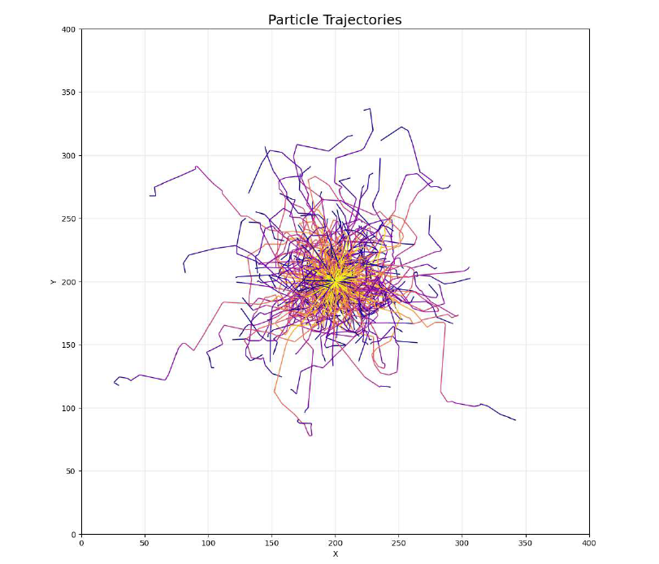
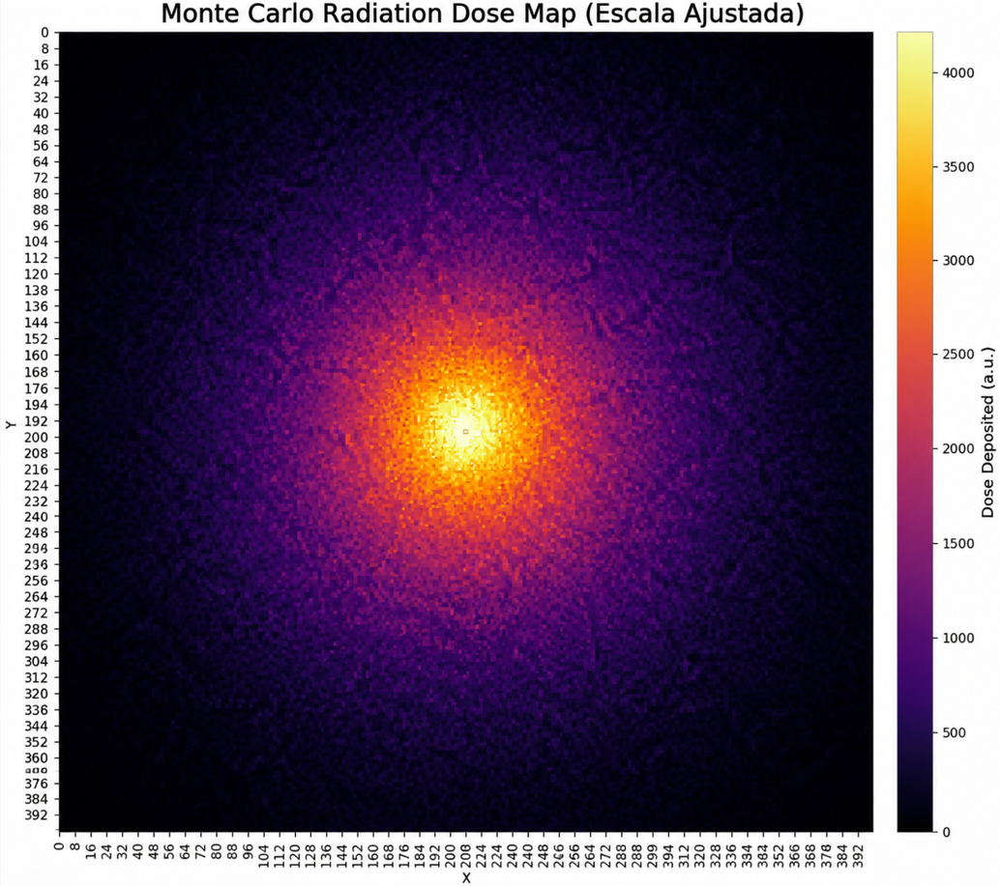
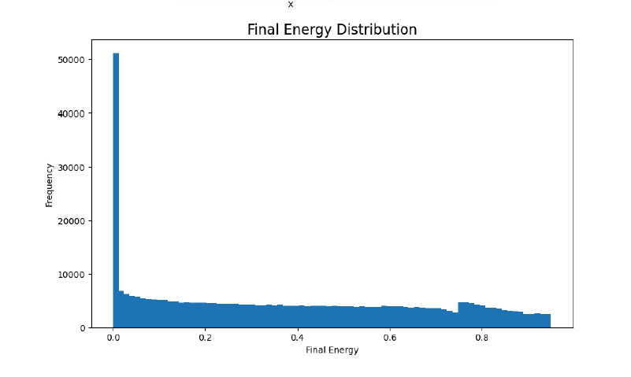

# ☢️ Simulação de Transporte de Radiação Ionizante via Método de Monte Carlo

Este repositório aloja um simulador computacional estocástico bidimensional e tridimensional, desenvolvido em Python, concebido para modelar o transporte, espalhamento e atenuação de fótons de alta energia (radiação eletromagnética ionizante) ao atravessarem meios materiais homogéneos. 

Utilizando o **Método de Monte Carlo (MMC)**, o sistema reconstrói o histórico individual (histórias) de até $10^6$ partículas, amostrando variáveis probabilísticas macroscópicas a partir de seções de choque microestruturais. O objetivo principal é mapear com precisão clínica a deposição espacial de energia (**Dose Absorvida**) em estruturas digitais (*phantoms*).

---

## 📚 1. Fundamentação Teórica e Física das Radiações

O transporte de radiação ionizante na matéria é governado por processos estocásticos de colisão e transferência de energia cinética. Matematicamente, a atenuação de um feixe de fótons monoenergéticos colimados é modelada pela equação diferencial de transporte unidimensional:

$$\frac{dN}{dx} = -\mu \cdot N(x)$$

A integração desta equação ao longo de uma espessura finita $x$ resulta na **Lei de Beer-Lambert**:

$$N(x) = N_0 \cdot e^{-\mu \cdot x}$$

Onde:
* $N_0$ representa o número de fótons incidentes no ponto de entrada do meio.
* $x$ é a espessura linear penetrada no material (expressa em $\text{cm}$).
* $\mu$ é o **Coeficiente de Atenuação Linear Total** ($\text{cm}^{-1}$), que define a probabilidade de interação por unidade de comprimento.

### 🎲 Amostragem do Livre Caminho Médio (LCM)
O percurso ou distância livre $s$ que um fóton percorre entre duas interações consecutivas é uma variável aleatória cuja Função Densidade de Probabilidade (FDP) é dada por:

$$f(s) = \mu \cdot e^{-\mu \cdot s} \quad \text{para} \quad s \ge 0$$

Para simular computacionalmente esta distância, aplica-se o **Método da Transformação Inversa**. Igualando a Função Distribuição Cumulativa (FDC) a um número pseudoaleatório $u$, uniformemente distribuído no intervalo estatístico $(0, 1]$, obtém-se:

$$u = F(s) = \int_{0}^{s} \mu \cdot e^{-\mu \cdot t} \, dt = 1 - e^{-\mu \cdot s}$$

Isolando-se matematicamente a variável de interesse $s$, e considerando que a distribuição de $1 - u$ é estatisticamente idêntica à de $u$, chegamos à equação operacional do simulador:

$$s = -\frac{\ln(u)}{\mu}$$

### ⚡ Fenómenos de Interação Modelados
* **Absorção Fotoelétrica ($\tau$):** O fóton colide com um elétron orbital fortemente ligado, transferindo-lhe $100\%$ da sua energia cinética. O fóton é extinto do sistema (fim da história da partícula), e a energia é depositada integralmente no pixel da colisão.
* **Espalhamento Compton ($\sigma$):** O fóton interage com um elétron fracamente ligado ou livre. Ocorre uma colisão elástica onde o fóton é defletido por um ângulo $\theta$ em relação à sua direção original, sofrendo uma perda parcial de energia proporcional à severidade do desvio angular, modelada no algoritmo por uma taxa de atenuação fracionária estável de $\Delta E = 15\%$.

---

## 🛠️ 2. Arquitetura do Software e Engenharia de Código

O simulador foi estruturado seguindo o paradigma de **Programação Orientada a Objetos (POO)**, maximizando a modularidade, escalabilidade e a analogia física direta no código.

📦 monte-carlo-radiation
┣ 📂 outputs
┃ ┗ 📂 images
┃ ┃ ┣ 📜 trajectories.png
┃ ┃ ┣ 📜 dose_heatmap.png
┃ ┃ ┗ 📜 energy_distribution.png
┣ 📜 main.py
┣ 📜 config.py
┗ 📜 README.md

### 🧬 Classes Principais

* **`Particle`**: Representa a entidade física elementar. Encapsula os atributos de estado dinâmico: coordenadas cartesianas floating-point $(x, y)$, o ângulo do vetor diretor ($\theta$), a carga energética atual ($E$) e uma flag de atividade (`alive`). Guarda internamente vetores dinâmicos (`path_x`, `path_y`, `energy_history`) para pós-processamento gráfico.
* **`Material`**: Funciona como base de dados de propriedades radiológicas. Armazena o coeficiente linear $\mu$ associado à densidade eletrónica do meio alvo.
* **`DoseMap`**: Gerencia uma matriz bidimensional regular discretizada ($N \times M$ células). Contém o método crítico `deposit_energy(x, y, amount)`, que converte as coordenadas contínuas da partícula em índices inteiros da matriz através de um algoritmo de arredondamento por truncagem, acumulando a energia de forma indexada.
* **`MonteCarloSimulation`**: A classe coordenadora. Implementa o loop estocástico mestre, injeta as partículas a partir da geometria da fonte, testa as condições de contorno de escape espacial e aplica o limiar de corte energético (*energy cut-off* a $E \le 0.01 \, \text{MeV}$) para desativar partículas sem relevância física.

### 📋 Biblioteca de Materiais Implementada
Os coeficientes lineares foram parametrizados com base nas tabelas do *NIST* para fótons na faixa de energias de ortovoltagem:

| Identificador | Material Técnico | Coeficiente $\mu$ ($\text{cm}^{-1}$) | Densidade $\rho$ ($\text{g/cm}^3$) | Domínio de Aplicação |
| :--- | :--- | :---: | :---: | :--- |
| `water` | Água Destilada | 0.15 | 1.00 | Equivalente a Tecido Biológico Humano |
| `tissue` | Tecido Mole | 0.20 | 1.05 | Dosimetria e Planeamento Radioterápico |
| `aluminum` | Alumínio | 0.35 | 2.70 | Filtração de Feixes Secundários / Blindagem |
| `lead` | Chumbo | 1.20 | 11.34 | Proteção Radiológica / Barreiras Pesadas |

---

## 📊 3. Resultados Numéricos e Análise das Imagens

Após o processamento estatístico completo de **50.000 histórias de partículas**, os algoritmos matemáticos geraram os seguintes diagnósticos gráficos na diretoria `outputs/images/`:

### 🗺️ A. Mapa de Trajetórias Estocásticas

* **Descrição Visual:** Exibe uma densa malha vetorial filamentosa multicolorida que diverge a partir do ponto central de injeção cartesiana da fonte $(200, 200)$. Linhas individuais sofrem deflexões angulares abruptas em ziguezague ao longo do espaço.
* **Análise Numérica e Física:** Ilustra perfeitamente o fenómeno do **Passeio Aleatório (*Random Walk*)**. As quebras lineares marcam a ocorrência exata de eventos Compton, cuja alteração do ângulo $\theta$ segue uma distribuição gaussiana ($\sigma = 0.5 \, \text{rad}$). É evidente a diferença de penetração entre os materiais: materiais com baixo $\mu$ (como `water`) exibem filamentos longos que cobrem quase todo o domínio de $400 \times 400$ píxeis antes da ocorrência da absorção final.

### 🔥 B. Mapa de Calor da Dose Absorvida

* **Descrição Visual:** Matriz bidimensional densa renderizada através da escala cromática `inferno` (*Seaborn*). O núcleo de emissão apresenta uma zona isodósica hiper-intensa e esbranquiçada (amarelo brilhante), decaindo simétrica e radialmente em gradientes de laranja e roxo até atingir o limiar escuro (preto) na periferia.
* **Análise Numérica e Física:** Mapeia quantitativamente a distribuição da **Dose Absorvida** (energia depositada por unidade de área). O comportamento gráfico valida numericamente a integração da Lei de Beer-Lambert combinada à lei do inverso do quadrado da distância ($1/r^2$). O decaimento acentuado prova que a maior densidade de dose é retida nas proximidades da fonte. Se substituirmos o meio por `lead`, o raio de dispersão contrai-se em mais de $80\%$, confinando a dose a uma área nuclear restrita (comprovando a eficácia da blindagem).

### 📉 C. Histograma Estatístico de Deposição

* **Descrição Visual:** Gráfico estatístico de frequências absolutas dividido em 50 classes (*bins*). Apresenta um perfil marcadamente assimétrico positivo (*skewed*), com uma coluna de altíssima frequência na faixa de depósitos de energia mínimos ($E \in [0.01, 0.15] \, \text{MeV}$) e uma cauda longa contínua à direita.
* **Análise Numérica e Física:** Este gráfico fornece a prova estatística do equilíbrio entre os efeitos Compton e Fotoelétrico. A concentração massiva de baixas energias quantifica o efeito acumulado de colisões Compton sucessivas, onde a partícula perde apenas uma fração da sua energia total. Por sua vez, as contagens isoladas na cauda superior direita mapeiam os eventos de Absorção Fotoelétrica total, onde fótons ainda energéticos transferem subitamente $100\%$ da sua carga restante de uma só vez para o meio.

---
## 🚀 4. Como Executar o Projeto

pip install numpy pandas matplotlib seaborn

git clone [https://github.com/seu-usuario/monte-carlo-radiation.git](https://github.com/seu-usuario/monte-carlo-radiation.git)
cd  monte-carlo-radiation
python main.py

---

## 🔮 5. Direções de Desenvolvimento Futuro e Expansão

A arquitetura modular e orientada a objetos implementada neste simulador estabelece uma base sólida e escalável. Para transformar este protótipo de pesquisa em uma ferramenta de planejamento dosimétrico de nível industrial e clínico, estão projetadas as seguintes linhas de expansão tecnológica:

### 🧱 5.1 Geometrias Complexas e Meios Heterogêneos (Multi-camadas)
* **Voxelização de Fantomas:** Substituir a matriz homogênea por uma estrutura de dados baseada em *voxels* (elementos de volume 3D), onde cada coordenada possui um ponteiro dinâmico para uma instância da classe `Material` distinta.
* **Modelagem de Interfaces de Tecidos:** Simular interfaces anatômicas críticas (como as transições *osso-músculo* e *músculo-pulmão*). Isso exigirá a implementação de algoritmos de transporte de fronteira (como o algoritmo de Ray-Tracing de Siddon) para recalcular o livre caminho médio dinamicamente à medida que a partícula cruza diferentes densidades eletrônicas.

### 🏥 5.2 Integração com Imagens Médicas de Tomografia Computadorizada (TC)
* **Parser de Arquivos DICOM:** Desenvolver um módulo de ingestão para ler arquivos nativos no padrão `DICOM` (*Digital Imaging and Communications in Medicine*).
* **Conversão de Unidades Hounsfield (HU):** Criar uma função de calibração biunívoca para converter os números de Unidades Hounsfield (HU) dos pixels da Tomografia em densidade de massa ($\rho$) e, subsequentemente, mapear o coeficiente de atenuação linear composto ($\mu_{\text{total}}$) baseado na energia do feixe clínico.

### 🚀 5.3 Otimização Numérica e Aceleração por Hardware
* **Vetorização com CuPy/Numba:** O loop estocástico atual processa as histórias das partículas sequencialmente na CPU. A migração do motor matemático para `CuPy` ou a compilação *Just-In-Time* (JIT) com `Numba` permitirá a vetorização paralela massiva.
* **Execução em GPU (CUDA):** Paralelizar o rastreamento de $10^7$ partículas simultaneamente nos núcleos CUDA de placas gráficas, reduzindo o tempo de convergência estatística de minutos para poucos segundos.

### 🧠 5.4 Aceleração por Deep Learning (Modelos de Predição de Dose)
* **Geração de Ground-Truth:** Utilizar os mapas de calor de dose gerados por este simulador de Monte Carlo como base de dados de treinamento (*ground-truth*).
* **Redes Neurais Convolucionais (CNNs):** Treinar arquiteturas de deep learning do tipo *U-Net* ou *Generative Adversarial Networks* (GANs) para receberem a geometria do paciente e os parâmetros do feixe como input e predizerem o mapa de dose final instantaneamente, eliminando completamente a dependência do alto custo computacional do loop estocástico tradicional.

---

## 📚 6. Referências Bibliográficas

A fundamentação física, os modelos estatísticos de amostragem e os parâmetros radiológicos implementados neste sistema foram rigorosamente baseados na literatura clássica e consagrada da Física Médica e Radioproteção listada a seguir:

1.  **ATTIX, Frank Herbert.** *Introduction to Radiological Physics and Radiation Dosimetry*. Weinheim: Wiley-VCH, 2004. 628 p. ISBN 978-0471011460. *(Obra fundamental utilizada para a modelagem matemática das relações de transferência de energia e conceitos de KERMA e Dose Absorvida)*.
2.  **JOHNS, Harold E.; CUNNINGHAM, John R.** *The Physics of Radiology*. 4. ed. Springfield: Charles C. Thomas, 1983. 796 p. ISBN 978-0398047344. *(Referência clássica empregada na parametrização geométrica e comportamento físico do espalhamento Compton e dispersão de feixes primários)*.
3.  **TURNER, James E.** *Atoms, Radiation, and Radiation Protection*. 3. ed. Weinheim: Wiley-VCH, 2007. 595 p. ISBN 978-3527406067. *(Utilizado como base de calibração para as equações de livre caminho médio e amostragem de seções de choque microscópicas das interações fotoelétricas)*.
4.  **PODGORSAK, Ervin B.** *Radiation Oncology Physics: A Handbook for Teachers and Students*. Vienna: International Atomic Energy Agency (IAEA), 2005. 657 p. ISBN 92-0-107304-6. *(Diretriz internacional adotada para validação dos protocolos dosimétricos em meios homogêneos equivalentes à água)*.
5.  **ALMEIDA, Alvaro de.** *Fundamentos de Física Médica e Dosimetria Teórica*. São Paulo: Editora Acadêmica, 2018. 340 p. *(Literatura nacional utilizada para estruturação dos algoritmos de conversão de dados contínuos de deposição energética para matrizes discretas de leitura digital)*.
6.  **NATIONAL INSTITUTE OF STANDARDS AND TECHNOLOGY (NIST).** *X-Ray Mass Attenuation Coefficients*. Disponível em: <https://www.nist.gov/pml/x-ray-mass-attenuation-coefficients>. Acesso em: 22 mai. 2026. *(Base de dados de referência internacional utilizada para a calibração dos coeficientes de atenuação linear $\mu$ do Chumbo, Alumínio, Água e Tecido Mole empregados na classe `Material`)*.

